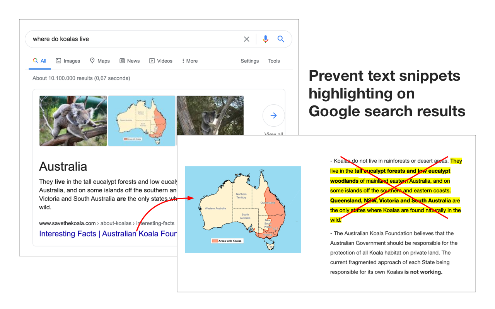

# Disable Text Highlights from Google Search Results

[ [Chrome Web Store](https://chrome.google.com/webstore/detail/disable-google-search-tex/ompocnnmgiaoieoanemepjflbokldhom) ]
[ [☕ Buy me a coffee](https://buymeacoff.ee/everyonesdesign) ]

Google Chrome introduced a feature highlighting relevant text snippet
by relying on the new
[Scroll to Text Fragment](https://chromestatus.com/feature/4733392803332096) API.

It seems that at the moment there is no way to disable the feature.
Because of that, some users got annoyed by the functionality
(e.g. see [this issue](https://github.com/WICG/scroll-to-text-fragment/issues/122)
of the original standard proposal).

### How to install it from source?

This manual is for Google Chrome

- Clone the repository or download as .zip file (if latter then extract the contents)
- To to Extensions page
- You'll have to enable Developer Mode (switch in the top corner)
- Click on "Load unpacked" button
- Choose "app" folder inside of the downloaded source

That's it, you're set!

### How can I disable this functionality?

In perfect case it would be possible to control "Scroll to Text Fragment"
from JavaScript interface.

In that case it would be easy to override/reset the highlight pattern.

However, currently it seems to be impossible to do so.

As a consequence, this extension changes all the links on
Google-hosted pages, removing the part responsible for text highlighting.

### What Google domains does this extension run on?

This extension runs only on Google Search domains

[This list](https://www.google.com/supported_domains)
has been used as a source of Google Search domains for this extension
